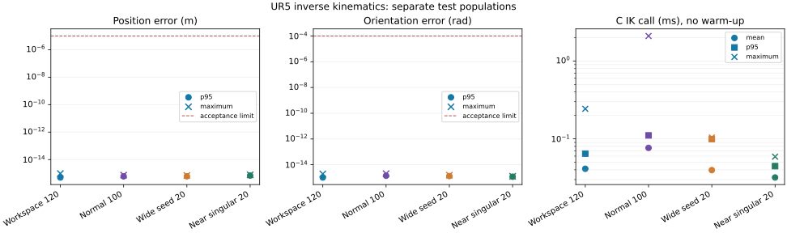

# UR5 逆解：误差、成功率、耗时与解析推导汇总

数据依据：[120 组逐目标/逐候选报告](../results/workspace120-batch-run/workspace120_batch/report.json)、[重新执行并提交的 100/20/20 组逐例报告](../results/closeout-ik/ik/report.json)、[机器可读汇总](../results/ik-summary/summary.json)与[指标图](../results/ik-summary/metrics.svg)。模型为标称 UR5 CB、项目标准 DH 参数，单位 m/rad；本汇总没有修改冻结输入、ABI 或算法。原始数据的库 SHA-256 均为 `9790b622d75d844a20ffdfd66951ddb07011feef9ed4af38261b3cc86360eea9`。140 组原始报告的文件 SHA-256 为 `1aa001564c9f6055847787f8ce333f14c593c2d67a443339067cd3dd76fbc31e`，与汇总 JSON 的 `source_sha256` 相符。上版汇总所用的逐例报告未曾提交且工作目录已清理；本版以这次重新执行的逐例报告为唯一 140 组来源，旧的 1.50228 ms 耗时不再作为证据。



## 统计口径与成功率

120 组空间样本以**目标**为成功率分母，返回全部 890 个解则以**候选**为回代误差分母。另有历史逆解专项 100 组普通、20 组宽初值、20 组近奇异；这一套的误差每目标取所有候选中的最大值，成功率仍以目标数为分母。两套报告独立展示，不相加为“260 个不重复目标”。每个目标需返回预期状态，解有限、在关节限位内且每一候选的 FK 回代满足位置 ≤1e-5 m、姿态 ≤1e-4 rad；异常组按预期错误码及输出不变验收。

| 测试组 | 成功／应执行 | 成功率 | 误差有效数／定义 | 备注 |
|---|---:|---:|---:|---|
| 空间 120 | 120/120 | 100% | 890 个候选 | 24 个空间区域各 5 例 |
| 普通 100 | 100/100 | 100% | 100 个目标最大候选误差 | 专项输入，独立统计 |
| 宽初值 20 | 20/20 | 100% | 20 个目标最大候选误差 | 专项输入 |
| 近奇异 20 | 20/20 | 100% | 20 个目标最大候选误差 | 不含精确奇异连续族 |
| 边界 16 | 16/16 预期状态 | 100% 预期状态符合率 | 12 次成功调用可报 C 内部耗时 | 4 例精确腕奇异预期 code=2003，不能记为成功逆解 |
| 异常 11 | 11/11 预期错误 | 100% 预期状态符合率 | 无有效位姿误差 | 失败输出不变 |

位置误差是 `||p_FK(q)-p_target||₂`，姿态误差使用相对旋转矩阵反对称量与迹的 `atan2` 角；数值分别以 m、rad 统计。对有效且可验证的误差输出有效数、平均、RMSE、P95 和最大值；失败而无有效输出的样本单独计入失败、误差记 `null`，不能补零。P95 使用排序后 `h=(n-1)×0.95` 的线性插值，先对原始值计算再展示。

| 组别与误差单位 | 位置均值 / P95 / 最大 (m) | 姿态均值 / P95 / 最大 (rad) |
|---|---|---|
| 空间 120，逐候选 | 2.051e-16 / 4.959e-16 / 9.587e-16 | 5.016e-16 / 1.024e-15 / 1.946e-15 |
| 普通 100，逐目标最大候选 | 3.727e-16 / 6.032e-16 / 7.370e-16 | 8.955e-16 / 1.405e-15 / 2.042e-15 |
| 宽初值 20，逐目标最大候选 | 3.822e-16 / 6.075e-16 / 6.924e-16 | 8.473e-16 / 1.325e-15 / 1.536e-15 |
| 近奇异 20，逐目标最大候选 | 4.149e-16 / 6.824e-16 / 7.745e-16 | 8.457e-16 / 1.175e-15 / 1.270e-15 |

120 组的 C FK 与显式参数 Robotics Toolbox FK 矩阵最大元素差为 2.220e-16。位置/姿态误差的 RMSE 与原始未舍入值见 JSON；图使用对数轴、圆点表示 P95、叉号表示最大值，虚线为预先冻结的回代阈值。

## 耗时：层级、平均、P95 与最大值

C 函数耗时来自成功返回的 `elapsed_s`，使用 C 内 `CLOCK_MONOTONIC`；Python→C 耗时来自已准备参数的单次 ctypes 调用前后 `perf_counter_ns`。边界组的 4 次 code=2003 无 C 内成功耗时，但其 Python→C 调用已经完成、可计入外层耗时。异常组的 `python_to_c_wrapper_ns` 包含输入准备，与上述 FFI 定义不同，所以不混入耗时图。表内耗时均为 ms，按**已完成且有对应字段**的调用统计，未计入输入生成、RTB 与绘图。

| 测试组 | C 有效数 | C 平均 / P95 / 最大 (ms) | Python→C 平均 / P95 / 最大 (ms) |
|---|---:|---|---|
| 空间 120 | 120 | 0.04127 / 0.06461 / 0.24320 | 0.04760 / 0.08794 / 0.24957 |
| 普通 100 | 100 | 0.07661 / 0.11071 / 2.09753 | 0.08131 / 0.11564 / 2.10548 |
| 宽初值 20 | 20 | 0.03966 / 0.09935 / 0.10413 | 0.04414 / 0.11067 / 0.11171 |
| 近奇异 20 | 20 | 0.03190 / 0.04460 / 0.05904 | 0.04781 / 0.08278 / 0.25741 |
| 边界 16 | 12 | 0.05375 / 0.08410 / 0.08542 | 0.05686 / 0.09278 / 0.09611（16 次） |

普通 100 组的 `normal_011` 和 `normal_023` 分别记录 1.39056 和 2.09753 ms 的 C 调用长尾；保留在 100 个样本的统计中。专项 140 个目标合并原始样本后：C 平均 / P95 / 最大为 **0.06494 / 0.09935 / 2.09753 ms**；FFI 为 **0.07121 / 0.11188 / 2.10548 ms**。140 组报告的 `script_work_wall_s=0.14703073 s` 是该脚本整段测试工作的墙钟，包含多次调用及验证；空间 120 组没有同口径的进程耗时字段，不能由逐次耗时相加冒充。两套数据各目标仅一次 `all` 测量、无预热和固定重复，且 C 的 0.2 s 协作预算并非硬超时；这些数值是功能测试的耗时观测，尚不能代替正式延迟验收或本机实机结果。普通组、宽初值组、近奇异组均无超时、异常或未收敛失败；专项 52 项异常均通过，其中故意设置超小预算的案例不归入普通耗时分布。

## 从模型到候选解的推导

标准 DH 链为 `A_i=Rz(θ_i)Tz(d_i)Tx(a_i)Rx(α_i)`，`θ_i=s_i q_i+o_i`。先剥离已知的基座、法兰和工具固定变换，得到 `T06=B⁻¹ T_base,tool G⁻¹ F⁻¹=[R,p;0,1]`。UR5 的 `a₂=-0.425 m`、`a₃=-0.39225 m` 保持符号，`d₄=0.10915 m`、`d₅=0.09465 m`、`d₆=0.0823 m`，所以不能以球腕近似忽略 `d₅`。

令 `p05=p-d₆ R[:,3]`（列序号从 1 开始），`X=p05_x`、`Y=p05_y`、`ρ=hypot(X,Y)`。肩部满足 `X sin θ₁−Y cos θ₁=d₄`：`ρ<d₄` 则肩分支不可达；否则 `θ₁=atan2(Y,X)+asin(d₄/ρ)` 或 `atan2(Y,X)+π−asin(d₄/ρ)`。每支置 `h=[sin θ₁,−cos θ₁,0]`，`[u,v,c]=hR`；当 `hypot(u,v)>1e-12`，令 `w∈{−1,+1}`，则 `θ₅=atan2(w hypot(u,v),c)`，`θ₆=atan2(−wv,wu)`。

消去已知腕部：`U=A₁⁻¹ T06 A₆⁻¹ A₅⁻¹=A₂ A₃ A₄`。设 `x=U₁₄`、`y=U₂₄`，肘部余弦 `c₃=(x²+y²−a₂²−a₃²)/(2a₂a₃)`；仅在 `|c₃|≤1`（浮点边界按既定 1e-12 容差）继续。两肘分支 `θ₃=±acos(c₃)`、`θ₂=atan2(y,x)−atan2(a₃sinθ₃,a₂+a₃cosθ₃)`、`θ₄=atan2(U₂₁,U₁₁)−θ₂−θ₃`。肩×腕×肘最多产生 8 个离散几何分支；肩相切或肘伸直时分支可能合并。

将每个 DH 角转换为满足限位的 `q_i=(θ_i−o_i)/s_i+2πk_i`，优先选距种子最近的合法 2π 表示；每候选经独立 C FK 回代、限位和误差验证，去重、字典序排列，再按未折返的六维关节行程选解。精确腕奇异 `hypot(u,v)≤1e-12` 使 `θ₆` 不唯一，可能出现连续族；`all` 不声称穷尽连续族而返回 2003。该分支不能被算入普通 120 组解算成功率。完整的角等价、奇异策略和模型来源见[解析推导](ur5-analytic-ik.md)与[模型约定](ur5-model-conventions.md)。

## 复现

在仓库根目录重新编译相同 C 源码、运行原始专项，再安装 matplotlib 并汇总：

```bash
mkdir -p build
gcc -std=c11 -O2 -Wall -Wextra -Werror -pedantic -fPIC -shared -Iinclude \
  src/common/abi_probe.c src/common/abi_v1.c src/kinematics/forward.c \
  src/kinematics/inverse.c -lm -o build/librobot_contract.so
python scripts/verify_c_ik.py --library build/librobot_contract.so --output results/closeout-ik/ik
sha256sum results/closeout-ik/ik/report.json
python scripts/summarize_ik_evidence.py --workspace-report results/workspace120-batch-run/workspace120_batch/report.json --ik-report results/closeout-ik/ik/report.json --output results/ik-summary
```

脚本从逐例报告重新计算均值、RMSE、线性插值 P95 和最大值，校验成功数、候选记录数及两报告的动态库哈希，再生成 `summary.json` 与 SVG。140 组原始报告包含全部 140 条样本、各候选解（994 条）及 52 项专项的通过／失败状态，不依赖缺失的旧报告。重复运行 C 测试时实测耗时、文件 SHA-256 通常会变化，必须同步更新汇总和图表。图表绘制环境 matplotlib 3.10.8，仅供展示；数值统计使用 Python 标准库。
